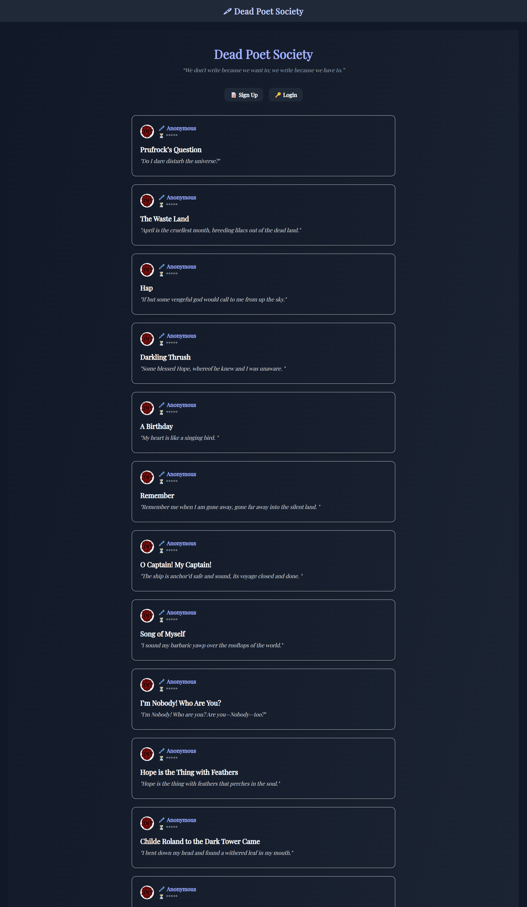
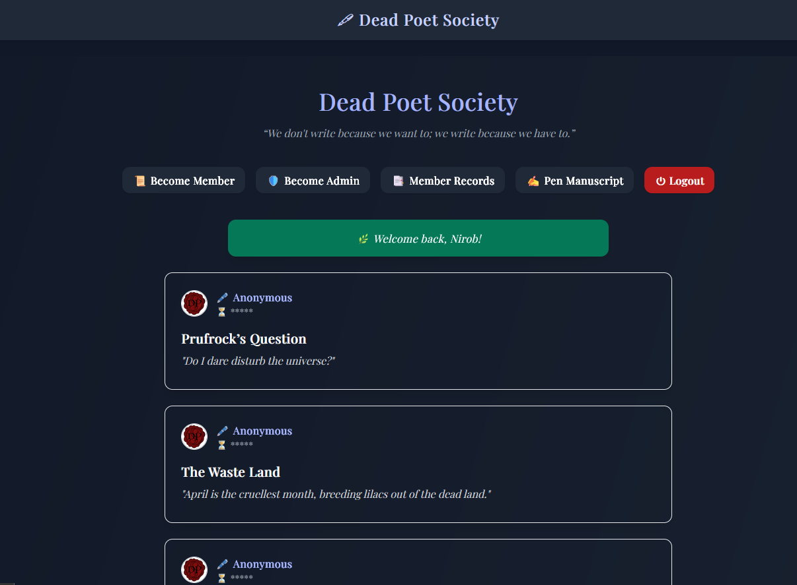
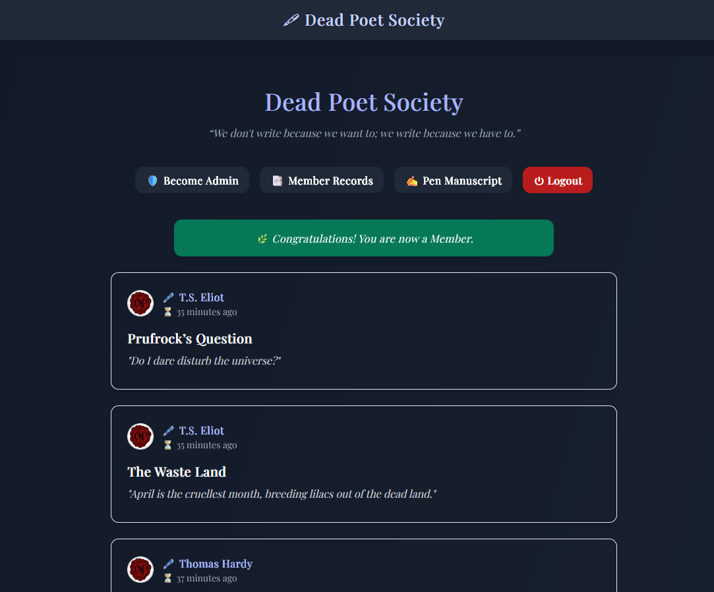
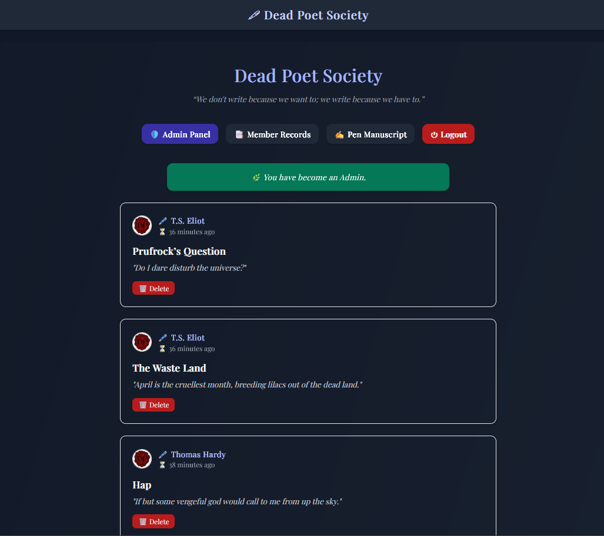
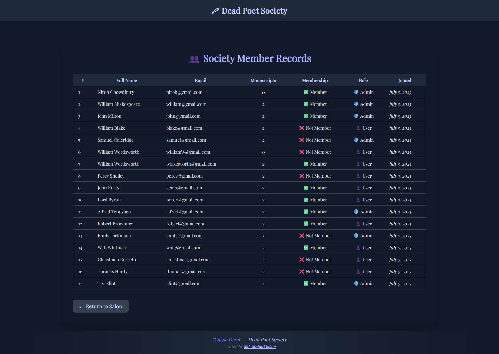
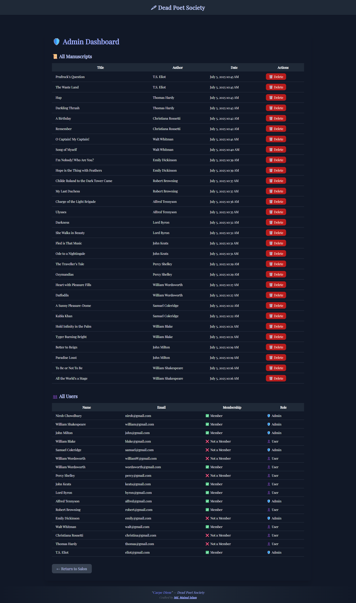

# 🖋 Dead Poet Society

An exclusive online **Salon of Words** where members can anonymously share manuscripts, reflect on timeless verses, and discover the power of anonymity and authorship. Built with **Node.js**, **Express.js**, **PostgreSQL**, **Passport.js**, and styled with **Tailwind CSS**.

---

## 🌸 Live Site

[View the Dead Poet Society](https://dead-poet-society.onrender.com/) 

---

## 📝 Features

- ✒️ **Anonymous Manuscripts:** Share your thoughts, poems, and stories while your name remains veiled to the public.
- 📜 **Membership Circle:** Only members can unveil the authors behind each manuscript and see when they were penned.
- 🕯 **Admin Role:** Guardians of the Society who can gently moderate and manage posts.
- 🛡️ **Secure Authentication:** Built with Passport.js, bcrypt, express-session, and form validation.
- 🎨 **Poetic, Minimal Design:** Tailwind CSS brings a soft, atmospheric touch inspired by literary salons.

---

## 🚀 Technologies Used

- **Node.js & Express.js**
- **PostgreSQL (with `pg` and `pg-pool`)**
- **Passport.js (Local Strategy)**
- **EJS Templating**
- **Tailwind CSS**
- **connect-flash & express-session**

---

## 🗝 Membership & Admin Secrets

- Members can join the **Inner Circle** by solving a riddle and entering a **secret code**.  
- Admins must decipher a more elusive clue to unlock full powers.

---

## 📂 Project Structure

```
dead-poet-society/
├── models/
│   ├── userModel.js
│   └── messageModel.js
├── routes/
│   ├── auth.js
│   ├── index.js
│   ├── member.js
│   └── message.js
├── views/
│   ├── auth/
│   ├── message/
│   ├── partials/
│   ├── admin/
│   └── layout.ejs
├── public/
│   └── styles.css
├── app.js
└── README.md
```

---

## 🛠 How to Run Locally

1. **Clone the Repository**
   ```bash
   git clone https://github.com/Mainul-Islam-Nirob/dead-poet-society.git
   cd dead-poet-society
   ```

2. **Install Dependencies**
   ```bash
   npm install
   ```

3. **Configure Environment**
   Create a `.env` file:
   ```
   DATABASE_URL=your_postgresql_connection_string
   SESSION_SECRET=your_secret
   ```

4. **Run Database**
   - Create a PostgreSQL database.
   - Run your `CREATE TABLE` scripts for Users and Messages.

5. **Run the Server**
   ```bash
   npm start
   ```

6. **Visit**
   ```
   http://localhost:3000
   ```

---

## ✨ Unique Elements

| Role      | Powers                                                               |
|----------|-----------------------------------------------------------------------|
| **Guest** | Can read anonymous manuscripts.                                       |
| **Member** | Can see author names & timestamps. Can write new manuscripts.         |
| **Admin**  | Can manage posts and view everything.                                |

---

## 📜 Credits & Inspiration

> “We don't write because we want to; we write because we have to.”  
> — **Dead Poets Society**

Inspired by literature, poetry, and the timeless urge to express.

---

## 🚀 Future Improvements

Here are some features planned for the next versions of **Dead Poet Society**:

- ✍️ **Comment System:**  
  Allow members to leave comments on manuscripts, fostering literary discussion.

- 👍 **Upvote / Like System:**  
  Introduce the ability to like or upvote manuscripts that resonate with readers.

- 👤 **User Profile Pages:**  
  Each user will have a public profile showing:
  - Display name
  - Bio
  - Favorite literary quote
  - List of manuscripts

- 🔍 **Search & Filter Manuscripts:**  
  Add the ability to search for manuscripts by keywords, author, or date.

- ✏️ **Edit & Delete Own Manuscripts:**  
  Members will be able to update or delete their own writings while maintaining privacy.

- 🛠 **Admin Role Management:**  
  From the Admin Panel, allow changing users' roles (Member ⇄ Admin) dynamically.


---

## 📧 Author

[Github](Mainul-Islam-Nirob)  

---

## 📸 Screenshots

### 🏠 Home Page


---

### 🙋‍♂️ User View (Non-Member)


---

### 🏛 Member View (After Claiming Membership)


---

### 🛡 Admin View


---

### 👥 Member Records


---

### ⚙️ Admin Panel

